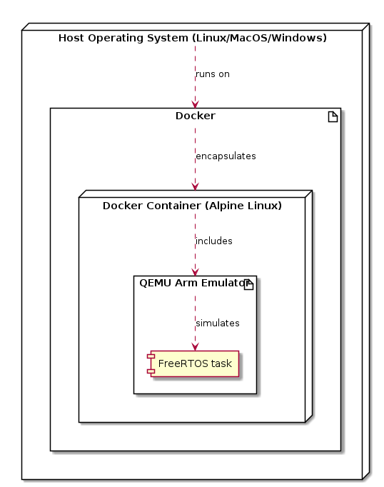

# ATOMIC Project Documentation

Welcome to ATOMIC! This guide will assist you in setting up and using the FreeRTOS environment for your development needs.

## Quick Start Guide

General technical overview of local development setup.



## Requirements

- [Docker](https://docs.docker.com/engine/install/) (or [Docker desktop](https://www.docker.com/products/docker-desktop/))
- Recommended: [Visual Studio Code](https://code.visualstudio.com/) with the [Remote Explorer](https://marketplace.visualstudio.com/items?itemName=ms-vscode.remote-explorer) extension.

### Getting started guide

Docker is required for containerization. Follow the installation guide available [here](https://docs.docker.com/get-docker/) to set it up on your system.

### Quick Setup

Get all submodules.

```bash
git submodule update --init --recursive
```

Easiest way to get started is to use `docker compose`. Clone the project to your local machine and run:

```bash
docker compose up -d --build
```

This will build and run the Docker container. The `docker-compose.yml` file ensures that the container is built and running as well as mounting the current work directory inside the container (at `/FreeRTOS`). Meaning you can access the source code within the container at this path.

You can now proceed from the [Developing with Docker](#developing-with-docker) section.

### Developing with Docker

There are two ways to acces the Docker container, the second one is preferred for development:

1. **Accessing the Docker container via SSH**:
   Connect to the Docker container with SSH using:

   ```bash
   ssh username@localhost -p 2222
   ```

   Default password is `password`.

2. **Using VSCode for Development**:
   Enhance your development experience with the `Remote Explorer` extension in VS Code. This will allow you to open Visual Studio Code as if you were running it **inside the container**. This makes it a lot easier to work with locally, since you can have a terminal inside the container and use the same tools as if you were running it locally.

---

### Building and Running the Project

#### Automatic

The container includes a file named `run.sh`. Running this ash script automatically runs the project in its standard configuration.

Setup networking by running setup script, once.

```bash
cd /FreeRTOS
./setup_network.sh
```

Then, to run the project:

```bash
cd /FreeRTOS
./run.sh
```

### Additional Resources

- [FreeRTOS on QEMU MPS2 AN385 Model](https://www.freertos.org/freertos-on-qemu-mps2-an385-model.html)
- [FreeRTOS Demo Applications](https://www.freertos.org/a00102.html#comprehensive_demo)
- [FreeRTOS API Reference](https://www.freertos.org/a00106.html)
- [FreeRTOS Kernel Quick Start Guide](https://www.freertos.org/FreeRTOS-quick-start-guide.html)
- [Understanding the FreeRTOS Directory Structure](https://www.freertos.org/a00017.html)
- [Demo we based this on](https://github.com/FreeRTOS/FreeRTOS/tree/main/FreeRTOS-Plus/Demo/FreeRTOS_Plus_TCP_Echo_Qemu_mps2)
- [Echo server](https://github.com/FreeRTOS/FreeRTOS-Libraries-Integration-Tests/tree/main/tools/echo_server)
